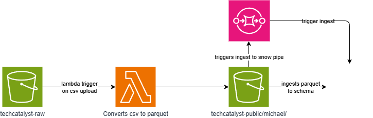

#### Analysis Table:

| **Method**         | **Purpose** | **Best Use Cases** | **Pros** | **Cons** |
| ------------------ | ----------- | ------------------ | -------- | -------- |
| `upload_file`      | Upload a file from local filesystem to S3 | • Uploading local files • Simple file transfers • Batch file uploads | • Simple to use • Automatic multipart upload for large files • Built-in error handling | • Requires file on disk • Cannot add metadata easily • Less control over upload process |
| `upload_fileobj`   | Upload file-like object (stream) to S3 | • Uploading in-memory data • Streaming uploads • Processing data on-the-fly | • Memory efficient • Works with any file-like object • Good for streaming data | • More complex than upload_file • Manual multipart handling needed • Requires file-like object interface |
| `put_object`       | Upload data directly to S3 with full control | • Small files/data • Adding custom metadata • Fine-grained control needed | • Full control over request • Can add metadata/tags • Works with raw data/strings | • No automatic multipart upload • 5GB size limit • More verbose code required |
| `download_file`    | Download S3 object to local file | • Saving files to disk • Simple downloads • Batch file downloads | • Simple to use • Automatic multipart download • Built-in error handling | • Always writes to disk • Less control over process • Cannot process data in memory |
| `download_fileobj` | Download S3 object to file-like object | • In-memory processing • Streaming downloads • Custom file handling | • Memory efficient • Flexible destination • Good for processing data | • More complex setup • Requires file-like object • Manual error handling |
| `get_object`       | Retrieve S3 object with full metadata | • Reading object metadata • Conditional downloads • Custom processing needs | • Full object information • Access to metadata/headers • Conditional retrieval | • Manual stream handling • More complex code • Need to manage response object |

#### Reflection Questions:

1. **Upload Methods**:
   - What are the key differences between `upload_file`, `upload_fileobj`, and `put_object`?
        - upload file works with files from local system
        - fileobj works with file like objescts bytesIO
        - put object works with raw data
   - When would you choose to use `put_object` over `upload_file` or `upload_fileobj`?
        - put object for maximum control over the upload process and working wuth smaller data that needs custom metadata
2. **Download Methods**:
   - How does `download_file` differ from `download_fileobj` and `get_object`?
        - download file outputs on disk, disk space
        - download obj output file like obj, memory effcient
        - get obj is a response object
   - In what scenarios would `get_object` be more beneficial than `download_file`?
        - need file properties, download only specific parts
3. **Efficiency and Performance**:
   - How do multipart uploads and downloads enhance the performance of file transfer operations?
     
     **Multipart uploads and downloads significantly enhance performance through several key mechanisms:**
     
     **Parallel Processing:**
     - Files are split into multiple parts (typically 5MB-5GB each) that can be uploaded/downloaded simultaneously
     - Multiple threads/connections work in parallel, maximizing bandwidth utilization
     - Example: A 1GB file split into 20 parts can use 20 parallel connections instead of 1
     
     **Improved Reliability:**
     - If one part fails, only that specific part needs to be retried, not the entire file
     - Reduces time lost due to network interruptions or temporary failures
     - Built-in retry logic for individual parts prevents complete restart
     
     **Better Resource Utilization:**
     - Maximizes available network bandwidth by using multiple connections
     - Reduces memory usage as parts can be processed and released sequentially
     - Allows for adaptive part sizing based on network conditions
     
     **Resume Capability:**
     - Failed uploads can be resumed from the last successful part
     - Prevents starting over from scratch for large file transfers
     - Maintains upload progress across network interruptions
     
     **Performance Benefits:**
     - Reduces total transfer time from hours to minutes for multi-GB files
     - Automatically optimizes part size based on file size and network conditions
   
   - What are the limitations of using `put_object` and `get_object` for large files?
     
     **Limitations of put_object and get_object for large files:**
     
     **Size Constraints:**
     - `put_object` has a hard limit of 5GB per request
     - Single request timeout limits (typically 12 hours max)
     - Cannot handle files larger than 5GB without splitting
     
     **Performance Issues:**
     - Single-threaded operation cannot utilize full bandwidth
     - No parallel processing capabilities
     - Slower transfer speeds for large files (>100MB)
     
     **Reliability Concerns:**
     - Complete restart required if transfer fails at any point
     - No resume capability for interrupted transfers
     - Higher risk of timeout for very large files
     
     **Resource Inefficiency:**
     - Requires loading entire file into memory for put_object
     - Cannot stream large files efficiently
     - May cause memory issues with very large files
     
     **Network Utilization:**
     - Underutilizes available bandwidth with single connection
     - More susceptible to network latency issues
     - Cannot adapt to changing network conditions
4. **Practical Applications**:
   - Consider a scenario where you need to upload a large video file to S3. Which method would you use and why?
     
     **For uploading a large video file to S3, I would use `upload_file` for the following reasons:**
     
     **Primary Choice: `upload_file`**
     - **Automatic Multipart Upload**: For files larger than 100MB, `upload_file` automatically uses multipart upload, which is essential for large video files (often GB in size)
     - **Built-in Error Handling**: Video files are valuable and irreplaceable, so the robust error handling and retry mechanisms are crucial
     - **Simplicity**: Clean, straightforward API that handles all the complexity behind the scenes
     - **Resume Capability**: If upload fails partway through, only failed parts need to be retried
     - **Performance**: Can achieve significantly faster upload speeds through parallel part upload
     
     **Additional Considerations for Video Files:**
     - Use appropriate storage class (STANDARD_IA or GLACIER for archival)
     - Enable server-side encryption for content protection
     - Consider adding metadata tags for content management
     - Monitor upload progress for large files using callbacks
   
   - If you need to process data in memory before saving it locally, which download method would be most suitable?
     
     **For processing data in memory before saving locally, I would use `download_fileobj` for the following reasons:**
     
     **Primary Choice: `download_fileobj`**
     - **Memory Efficiency**: Downloads directly into a file-like object (BytesIO) without requiring disk space
     - **In-Memory Processing**: Allows immediate data manipulation without temporary file creation
     - **Flexible Workflow**: Can process, transform, and then decide where/how to save the final result
     - **No Disk I/O Overhead**: Avoids the performance penalty of writing to disk then reading bac
     
     **Use Cases:**
     - Data cleaning and transformation pipelines
     - Format conversion (CSV to JSON, etc.)
     - Data validation before local storage
     - Memory-constrained environments where temporary files should be avoided

# Final 

## Bringing it all together 

* What are some of the use-cases for this solution?
#### **Architecture Benefits**
- **Scalability**: can scales automatically based on data volume without manual intervention
- **Cost Efficiency**: pay for code model with Lambda and optimized storage with Parquet format
- **Real-time Processing**: Near real-time data availability for immediate business insights
- **Data Quality**: Consistent data transformation and validation ensures high-quality analytics
- **Reduced Maintenance**: Serverless architecture minimizes operational overhead

#### **Technical Advantages**
- **Format Optimization**: Automatic conversion to Parquet reduces query costs and improves performance
- **Error Handling**: Built-in retry mechanisms and error logging for reliable data processing
- **Monitoring**: CloudWatch integration for comprehensive pipeline monitoring and alerting
- **Security**: End-to-end encryption and IAM-based access control for data security
